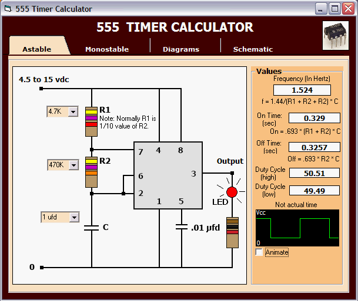



## Calculator 555 Timer \(update 3:  5\-11\-2010\)

### Description

Calculate the values needed for a 555 timer. Lots of room for improvements. Update1--Got the graphs to plot better and corrected some errors. update2: Animated the monostable graph.update3:corrected a couple of errors and optimized code.
 
### More Info
 

             |
---                |---
**Submitted On**   |2010-05-11 10:25:46
**By**             |[Kenneth Foster](https://github.com/Planet-Source-Code/PSCIndex/blob/master/ByAuthor/kenneth-foster.md)
**Level**          |Intermediate
**User Rating**    |5.0 (45 globes from 9 users)
**Compatibility**  |VB 6\.0
**Category**       |[Miscellaneous](https://github.com/Planet-Source-Code/PSCIndex/blob/master/ByCategory/miscellaneous__1-1.md)
**World**          |[Visual Basic](https://github.com/Planet-Source-Code/PSCIndex/blob/master/ByWorld/visual-basic.md)
**Archive File**   |[Calculator2180805112010\.zip](https://github.com/Planet-Source-Code/kenneth-foster-calculator-555-timer-update-3-5-11-2010__1-73115/archive/master.zip)

